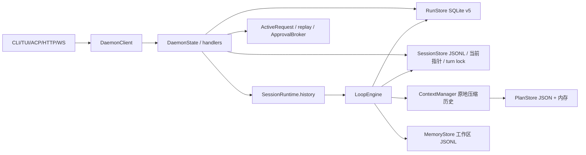
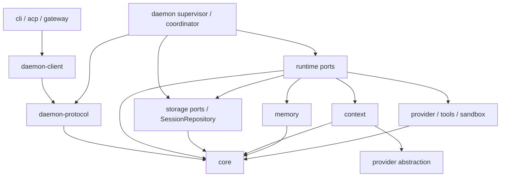
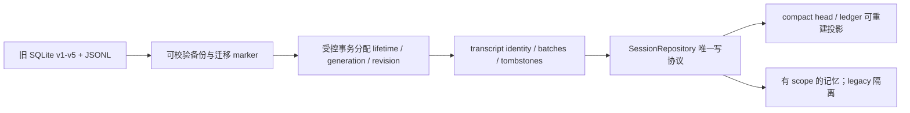
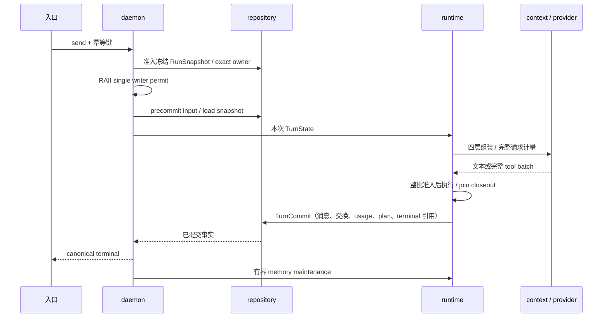
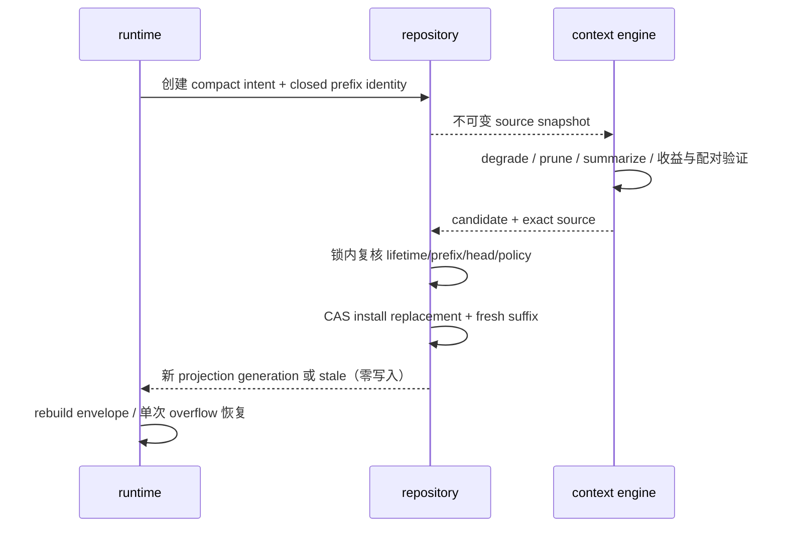
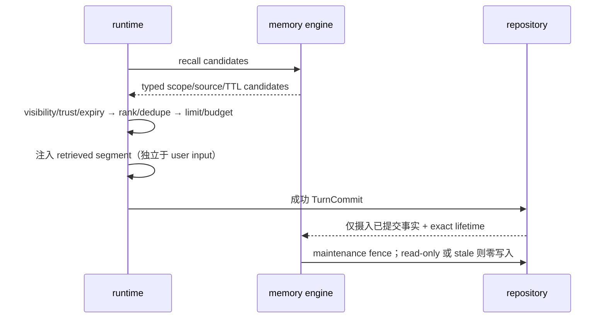
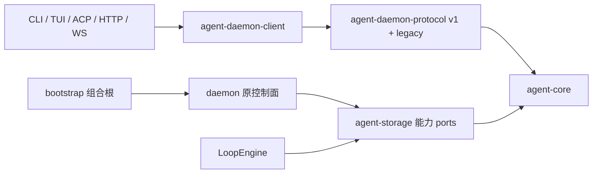
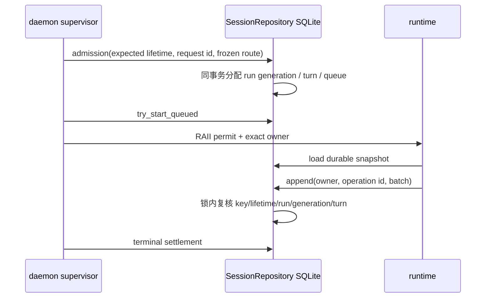
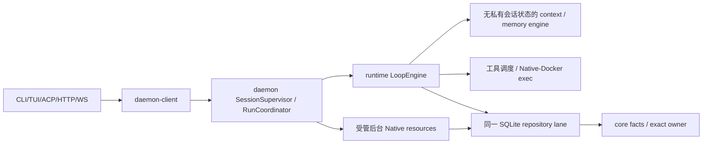

# ADR 0001：Runtime 的身份、事实与迁移边界

日期：2026-10-01。状态：接受目标架构；实现进度见 [实施记录](../changes/runtime-architecture.md)。

## 事实依据与现状

基线提交 `2f204df`，工作区干净。`cargo test --all-targets`：197 个单元测试、7 个真实 daemon 契约测试通过。以下描述来自当前仓库，不依赖其他仓库。

| 数据 | 当前写入 owner | 当前意义 | 目标分类与 owner |
|---|---|---|---|
| sessions/runs/turns/queue/events/interactions/delegations | RunStore；daemon 决定控制行为 | 持久控制事实 | canonical；SessionRepository 事务，daemon 控制面 |
| JSONL 消息 | SessionStore；LoopEngine 调用 append | 持久消息事实，无共同 revision | canonical append-only transcript；唯一 repository 写协议 |
| SessionRuntime.history | daemon 加载，LoopEngine 修改，context 压缩 | 实际模型输入，重启无法还原摘要 | 删除长期 mutable owner；每 turn 从 durable snapshot 构造 |
| plan.json + PlanStore.state | PlanStore + PlanTool | 工作区计划与缓存，尚未纳入 TurnCommit | canonical plan revision + 可重建缓存 |
| memory.jsonl | MemoryStore + remember 工具 | 工作区记忆，无 scope/source | canonical memory entry；旧数据隔离 legacy scope |
| ActiveRequest/broadcast/replay | daemon | 活请求与低延迟通知 | ephemeral cache；不能决定 canonical terminal |
| ApprovalBroker.pending | daemon | 等待执行体的唤醒器 | ephemeral；interaction 的 SQLite CAS 才是事实 |
| trace/provider attempt/tool receipt/artifact | SessionStore / RunStore | 诊断、回执、输出 | audit evidence；工具结果未知不能从日志猜测成功 |
| FrozenRoute/config generation | ProviderManager + RunStore | 准入冻结路由，排队重启可恢复 | durable RunSnapshot；实现对象为 cache |
| Native ResourceManager | sandbox 进程内 map | 进程组清理；不持久 | exact owner 绑定资源，daemon 终态；Native 为软边界 |

`RunStore::finish` 已在 SQLite 事务里提交 assistant_content 和 terminal 后才广播；JSONL append 仍在此前发生，存在跨介质崩溃窗口。现有 `recover` 对 running/等待交互标记 unknown，不重放副作用；queued 保留。子 Agent 已按持久关系树隔离和取消。以上兼容行为必须保留。

## 决策与依赖

先提取实际共用的领域类型和 wire 编码，旧模块只 re-export 同一类型，不能复制定义或增加 owner。端口必须有真实实现和调用者才引入。不得把未来端口骨架称为已实现。库中新增代码使用 thiserror；禁止 unwrap/expect/println。已有单 crate 代码的技术债按 wave 消除，静态护栏明确区分现状与目标。

公开 `SessionKey` 与内部 `SessionLifetimeId` 分离；`ExactOwner` 同时比较 key、lifetime、run、generation、turn。纯领域 fence 只验证传入值；**数据库事务内部复核、tombstone 和新 lifetime 分配属于 Wave 2，不能用进程外提前比较代替**。Wave 0 不把虚构 lifetime 写入既有 v5 数据。

事务/路由锁序：session lane → SQLite write transaction → transcript intent/commit marker → 提交 → 广播。跨 SQLite/JSONL 前向恢复必须先持久 intent 再发布 commit marker；未确认外部副作用只能 unknown。terminal、客户端响应与 memory flush 分离。

## 迁移图

Wave 0 不改变 schema（仍为 v5）、文件路径或 wire JSON。后续只向前迁移，未来版本 fail closed；dual-read 新优先，dual-write 最迟 Wave 2 收口。缺失、损坏、删除与 unknown 必须区分。

## 目标 turn、compact、memory 时序

## 护栏与后果

架构测试解析 Rust AST，排除显式测试模块；检查禁止依赖、context 的私有消息/map 字段，以及已有长期历史 owner 的精确名单。兼容 facade 必须只是 re-export；新增 crate 用 Cargo 实际依赖图检查。现有 terminal/restart/queue/三入口测试继续运行。冻结现状并不等于解决持久压缩或 lifetime 隔离，具体未实现项见 change doc。

## Wave 1 已落实的依赖（2026-10-01）

client 和 SQLite implementation 已物理提取，根 facade 仅 re-export；原协议参数定义与 Provider 持久 facts 已统一。在线 ports 与 maintenance ports 使用同一 RunStore，没有新增业务状态副本。此图不改变上文现存 transcript/内存 history owner：其统一持久身份与写入协议属于 Wave 2，未实现。

## Wave 2 实际写入协议（2026-10-02）

SQLite v6 的 session_heads 是 lifetime/revision/generation 唯一事实；transcript_batches 是 canonical append-only 消息。JSONL 在首次导入前保留原始字节备份，SQLite 旧版本升级前 VACUUM 备份并校验 integrity/schema/SHA256 marker。新 metadata 和 trigger 在同一前进 migration 中发布。

所有在线与 cron 写入经 SessionRepository，SQLite Mutex + transaction 是共同 routing lane；daemon admission 和 lifecycle 另共享短 control barrier。执行持有 RAII writer gate，持久 running/queued 事实不受连接断开或等待时间释放。destructive lifecycle 对 active/queued/unknown 未结算执行 fail closed，调用方必须先精确 cancel/reconcile；没有按时间强拆。

SessionRuntime.history 已删除；每 turn 的局部 Vec 是 disposable execution overlay。旧 compact 算法暂时只改此局部值，持久 compact 属 Wave 4。Trace 按 lifetime 物理隔离；旧 JSONL/trace 保留为维护证据，不再是在线写入路径。SessionRepository 的兼容名称 ControlRepository 指向同一个 trait。

## Wave 2–7 当前所有权（2026-10-02）

| 状态 | 唯一 owner | 派生/临时数据 |
|---|---|---|
| session lifetime、revision、routing、tombstone | SQLite SessionRepository | SessionSupervisor 的实例/writer/锁不持有 history |
| run/turn/queue/terminal/plan/tool closure | SQLite RunRepository/TurnRepository | RunCoordinator 的 tasks、tokens、冻结实例只服务当前进程 |
| 原始消息与完整工具交换 | canonical transcript batches | JSONL 为一次导入来源/字节备份，在线不 append |
| compact projection/head/receipt、usage ledger | SQLite ContextRepository | context 的候选不可变输入，不维护会话状态 |
| scope/source/TTL、ingest/forget receipt | SQLite MemoryRepository | 每 turn 有界 recall，legacy 隔离 |
| 后台资源身份/状态/日志、artifact 引用 | SQLite ResourceRepository/artifact | daemon 持真实 Child/取消句柄并监督 join |
| provider/MCP secret | env 或系统 Keychain | JSON 仅引用；provider 构造时解析 |

schema v12。clear/delete 的屏障针对 active/queued run 和仍运行资源；unknown 是明确未知终态，不按运行时间或 ID 前缀猜测。所有迟到 mutation 仍复核 exact lifetime。compact 安装和 terminal 发布均发生在事务持久成功之后，客户端断线或 wait 超时不决定业务终态。

ContextEngine 的候选不直接写 repository；图中的 context/memory 到 repository 边由 runtime ports 调用完成。强隔离后台资源未实现时 fail closed；Native 不宣称对同 UID 恶意 shell 提供强隔离。远程 MCP 重定向/代理禁用与 DNS pinning 不改变工具默认 external/审批/未知结果政策。
