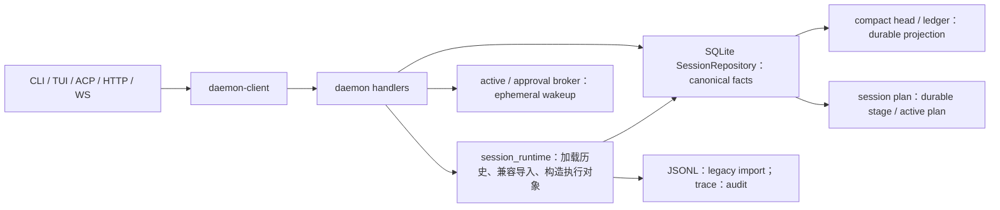
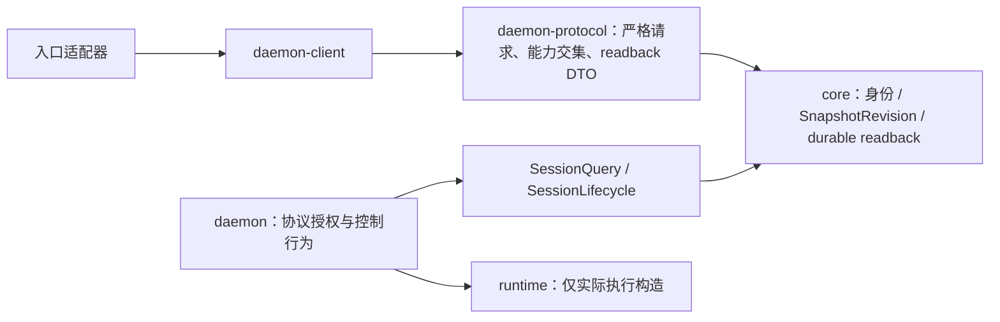
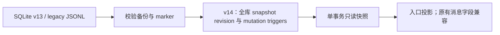
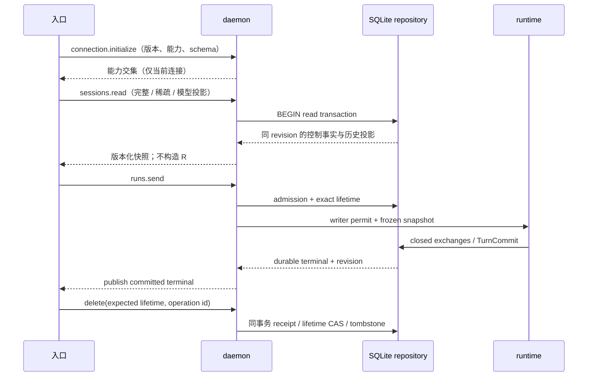

# ADR 0002：只读恢复快照与生命周期请求屏障

日期：2026-10-05。状态：已实施并通过本地验收（本 ADR 范围）。基线：`35af558`，工作树干净，SQLite v13。

本轮沿用 ADR 0001 的唯一 repository 写协议，不新建会话事实源。源码核验发现早期 Wave 的实际缺口，本轮补齐 Wave 0–2 的恢复读取与身份屏障纵切；后续完整验收尚未完成。

## 当前状态所有权

SQLite metadata/lifetime、transcript batches、runs/turns/queue/interactions、记忆与资源是权威事实；compact head、ledger、列表与 readback 是可重建投影；runtime、broadcast、replay 与 broker 是缓存；JSONL 是一次性兼容输入，trace/provider attempts/tool receipts 是审计。`PlanStore` 的非在线 fallback 仍存在，不能描述为已完成 Wave 5B。

## 决策与目标依赖

- 读取、历史展示与 attach 不构造 runtime，不导入 JSONL，不创建 session，不触发 MCP/模型修复。
- 公共恢复快照在一个 SQLite read transaction 内读出 lifetime、transcript revision、projection generation、active exact owner、稳定 queue rows、pending interactions、最后 durable terminal、plan 与 context ledger。`snapshot_revision` 由同库 mutation trigger 单调推进，不以时间戳猜新旧。
- 稀疏快照显式记录省略区；任何空数组只有在该区已加载时才意味着为空。模型历史只从已安装 compact projection 加 fresh suffix 读取。
- 所有 destructive RPC 请求必须携带 expected_lifetime，在同一事务内 CAS；兼容方法名仍映射到同一 command，缺身份的旧请求返回 -32602，不猜当前 lifetime。receipt 同时绑定 expected lifetime，旧请求重试不得对新 incarnation 产生写入。旧格式 receipt 只允许匹配原 lifetime 的结果读回。
- 连接初始化交换明确版本与 schema 能力交集；重连重新协商，未协商扩展在准入前拒绝。legacy 客户端保持集中兼容模式。
- 库级 unwrap/expect/stdout 规则通过 AST 与 Clippy 检查生产代码，不依赖字符串扫描测试代码。

## 迁移

不 dual-write transcript，不删除原始证据。v14 只增加恢复投影身份，旧会话 lifetime 不变；未知未来 schema fail closed。

## Turn 与恢复时序

完整压缩、记忆与工具流水线继续遵守 ADR 0001；本轮不把后续未接线能力描述成完成。

## 实际语义与限制

`snapshot_revision` 是数据库级单调游标，同一事务可推进多次，其他 session 的写入也会推进；它不表示 transcript 消息数量。`metadata_revision` 由相关 metadata mutation 推进，`transcript_revision` 是 canonical 消息序号，`projection_generation` 是模型历史投影版本。回滚不消耗已发布的游标。

`history_mode=canonical` 返回原始证据；`model` 返回已安装 compact projection 加新后缀，显式省略 stable prefix、recall 与 overlay；`omitted` 不解析历史，用省略标记区别“没加载”和“为空”。`session.load_page` 保留消息 batch 边界并附完整控制区，但属于分页 wire DTO，不能当作完整 `SessionReadback` 解码。展示字段 `capability_generation=1` 表示当前静态协议 schema 集合，不表示工具 catalog generation。

恢复读取不改变 preferred session。JSONL 兼容导入仍由既有启动迁移/实际执行加载边界受控执行；公共 readback 不做导入。SQLite 只读失败不会创建空会话。`supersedes` 提供比较规则，但所有入口的 live event 与恢复快照统一防回退接线**未实现**。

验证覆盖两后端、v13→v14 备份/重启、两连接并发读写、失败 terminal 回滚、坏 transcript fork 拒绝、真实 daemon 重启和三个入口。具体测试名、门禁及未实现项见 [实施记录](../changes/runtime-readback-fences.md)。
